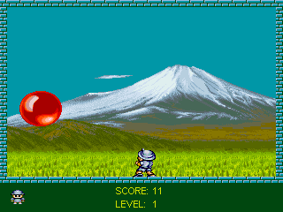

# Pang for Linux!

<p align="center">
<a href=""></a>
</p>

[![Contributors][contributors-shield]][contributors-url]
[![Forks][forks-shield]][forks-url]
[![Stargazers][stars-shield]][stars-url]
[![Issues][issues-shield]][issues-url]
[![GPLv2 License][license-shield]][license-url]
[![LinkedIn][linkedin-shield]][linkedin-url]

## About the project

Pang for Linux! is a clone of the [1989 arcade game Pang!](https://en.wikipedia.org/wiki/Buster_Bros.). 

## Prerequisites

You need SDL2, SDL2 Mixer, SDL2 Image, and SDL2 GFX to compile this game.

## Getting Started

```
cd src/
make
```

## Controls

Use the left and right arrows to move the character on screen, and press the letter C to shoot a wire upwards.

## License

This game is released under the GPLv2 license.

## Acknowledgments

This game is a tribute to the original “Pang!” arcade game, released in 1989 by Mitchell Corporation.

## Author

The code have originaly been written by [Michel Louvet](https://github.com/bfggamepassion).

SDL2 port by Marc-Alexandre Espiaut.

<!-- MARKDOWN LINKS & IMAGES -->
<!-- https://www.markdownguide.org/basic-syntax/#reference-style-links -->
[contributors-shield]: https://img.shields.io/github/contributors/malespiaut/pang.svg?style=for-the-badge
[contributors-url]: https://github.com/malespiaut/pang/graphs/contributors
[forks-shield]: https://img.shields.io/github/forks/malespiaut/pang.svg?style=for-the-badge
[forks-url]: https://github.com/malespiaut/pang/network/members
[stars-shield]: https://img.shields.io/github/stars/malespiaut/pang.svg?style=for-the-badge
[stars-url]: https://github.com/malespiaut/pang/stargazers
[issues-shield]: https://img.shields.io/github/issues/malespiaut/pang.svg?style=for-the-badge
[issues-url]: https://github.com/malespiaut/pang/issues
[license-shield]: https://img.shields.io/github/license/malespiaut/pang.svg?style=for-the-badge
[license-url]: https://github.com/malespiaut/pang/blob/master/LICENSE.txt
[linkedin-shield]: https://img.shields.io/badge/-LinkedIn-black.svg?style=for-the-badge&logo=linkedin&colorB=555
[linkedin-url]: https://linkedin.com/in/marc-alexandre-espiaut-a77b49153/
